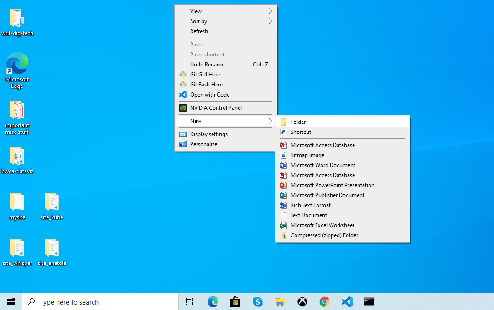
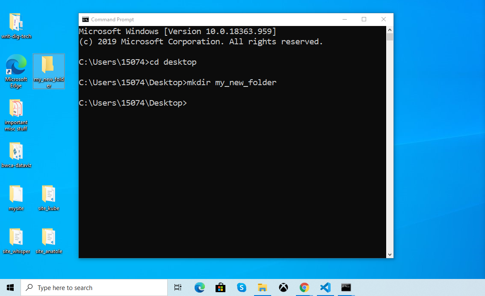

There are two common ways to interact with most computers: the graphical user interface (GUI) and the command line interface (CLI) Most people are only familiar with the graphical user interface-- the system of graphical elements (e.g., windows, buttons, icons) that we can use to interact with our operating system. 

A less common, but incredibly useful way to interact with our computer is the command line interface. The CLI is a program that allows you to interact with your computer not through graphical elements, but rather through **text-based commands**. On Mac, the program used to interact with the CLI is called Terminal and on Windows it's called Command Prompt.

## A simple, illustrative example

If it's helpful, you might think of a GUI as a program that issues text-based commands behind the scenes so you don't have to. In fact, several common tasks can be performed with either the GUI or CLI. For example, creating a new folder on your desktop.

**Creating a new folder on your desktop (Windows 10)**

=== "GUI"

    

    *Above: creating a new folder via GUI (Windows 10)*

=== "CLI"

    

    *Above: creating a new folder on your desktop via CLI (Windows 10)*

## Why use the command line?

I have a mouse and applications...why even bother with the command line? 

* Fosters a deeper understanding of how digital systems work
* Allows you to interact with systems to which you don't have graphical interface access 
* Some functions are only available via CLI
* Can be more efficient for certain tasks

## Learn more about the command line interface

### History/Background

### Tutorials

### Reference guides

